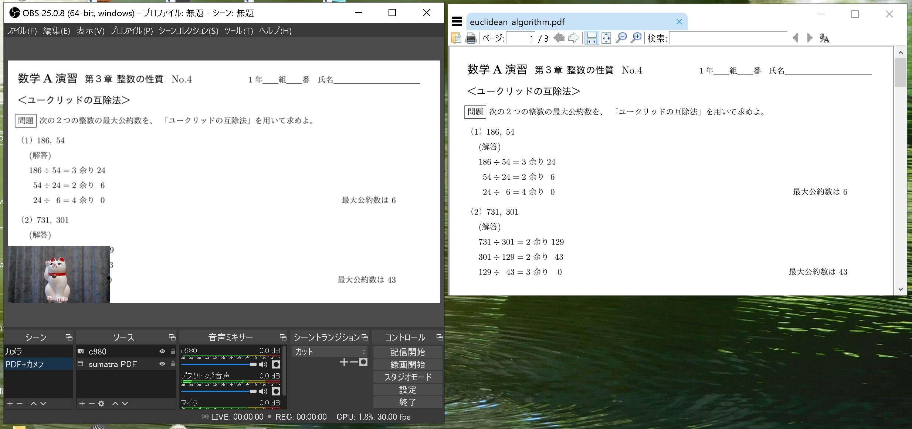

## OBS Studio で授業動画を作る (Japanese version only)  

DEMO→[YouTube](https://www.youtube.com/watch?v=ogxKhS5n1Gk)を見てください  
比較的簡単に作れます  
Windowsで動作確認していますが、他のOSでも多分同様  

###  OBS Studio とは  
OBS studio(Open Broadcaster Software) はビデオ録画と生放送用の無料でオープンソースのソフトウェア

### OBS Studio の動作環境  
「OBS Studio の Windows リリースでは、Windows 8、8.1 および 10 をサポートしています」
の記載があるのみ  
CPU Core i5 , RAM 8GB 以上がスムーズに動く環境だと思うのですが、  
それ以下の環境でもある程度は録画可能  
DEMO動画は CPU 1.20GHz, 4GB のためスムーズな映像ではない  

### 必要な周辺機器
- パソコン内蔵カメラ または、外付けのwebカメラ(現在品薄)
- スキャナー(pdf 作成のため)  

### インストール
- [OBS Studio](https://obsproject.com/ja/download) 
ダウンロード、インストーラをクリック  
OBS-Studio-25.0.8-Full-Installer-x64.exeを実行  
C:\Program Files\obs-studioにインストール  
デスクトップに OBS Studio のアイコンができます  
自動ウイザード はいいえ、OK  
 

- pdf 閲覧ソフト  
[AdobeAcrobatReaderDC](https://get.adobe.com/jp/reader/) 一番よく使われているが、重い  
[Sumatra PDF](https://www.sumatrapdfreader.org/free-pdf-reader.html) 小さい、軽い、私のおすすめ  
Web ブラウザ(Google Chrome 等) でも閲覧可能  

### OBS Studio の使い方

1. pdf 閲覧ソフト(Sumatra PDF等)を立ち上げ、    
適当なpdfファイル(euclidean_algorithm.pdf 等)を開いておく  

1. コントロール 設定 映像  
基本(キャンバス)解像度　出力(スケーリング)解像度　はどちらも1280x720  
FPS共通値は30　OK  
(FPS は Frame per Second の略で、1秒間の動画で見せる静止画の枚数（コマ数))  

1. シーンを右クリック  
名前を変更　「カメラ」 入力    
ソースの下の＋をクリック  
映像キャプチャデバイス 新規作成　名前を入力　OK 
デバイス　選択(内臓カメラ または 外付けwebカメラの名前) OK  
入力した名前のプロパティが開く  
解像度/FPS タイプ　カスタム    
解像度 1280x720 選択 OK  
映像画面 カメラの映像を好みの大きさ・位置に ロックプレビュー　check　　

   

1. シーンの下の＋をクリック
「PDF+カメラ」 入力　OK  
ソースの下の＋をクリック  
ウィンドウキャプチャ 新規作成 適当な名前「Sumatra PDF」等を付けておきます OK  
ウインドウで[SumatraPDF.exe] を選択  
カーソルをキャプチャのcheckは外さない  
ソースの下の＋をクリック  
既存を追加　OK  
カメラの映像は 順序→最上部に移動  
映像画面 カメラとPDFの映像を好みの大きさ・位置に　ロックプレビュー  check  
　   

1. 右の PDF閲覧ソフトの画面をclickしてスクロール  
左のOBSの画面もそれに伴って動く筈です  
録画開始をclickし、シーンを切り替え、好みの授業動画を作ってみてください  

